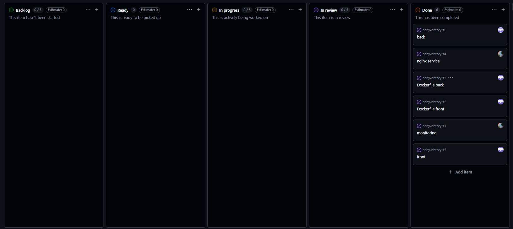

# Baby-History

Application web de gestion de matchs de baby-foot avec suivi en direct, historique, authentification utilisateur et observabilite.


## Fonctionnalites

- Connexion et inscription utilisateur (JWT)
- Match en direct (creation de match, mise a jour du score)
- Historique des matchs
- Fin de match et suppression
- API REST backend Node.js/Express
- Base PostgreSQL
- Reverse proxy Nginx
- Observabilite avec Prometheus et Grafana
- Export de metriques backend, PostgreSQL et Nginx

## Stack technique

- Frontend: React 18 + Vite
- Backend: Node.js + Express
- Base de donnees: PostgreSQL 15
- Proxy: Nginx
- Observabilite: OpenTelemetry, prom-client, Prometheus, Grafana
- Conteneurisation: Docker, Docker Compose

## Architecture

- frontend: interface React servie par Nginx interne
- backend: API Express sur le port 3001 (interne)
- db: PostgreSQL avec volume persistant
- nginx: point d'entree externe sur http://localhost:8080
- prometheus: collecte de metriques sur http://localhost:9090
- grafana: visualisation sur http://localhost:3000
- exporters:
  - nginx-prometheus-exporter
  - postgres-exporter

## Demarrage

Prerequis:

- Docker
- Il faut mettre en place les variables d'environnements présent dans le .env.example

Lancement:

```bash
docker compose up -d --build
```

Arret:

```bash
docker compose down
```

Arret complet avec suppression des volumes:

```bash
docker compose down -v
```

## URLs utiles

- Application: http://localhost:8080
- API healthcheck: http://localhost:8080/api/health
- Prometheus: http://localhost:9090
- Grafana: http://localhost:3000

## Authentification

Routes disponibles:

- POST /api/auth/register
- POST /api/auth/login
- GET /api/auth/me

Le token JWT est envoye via l'en-tete Authorization: Bearer <token>.

## API matchs

- GET /api/matches
- GET /api/matches/current
- GET /api/matches/:id
- POST /api/matches (auth requis)
- PATCH /api/matches/:id/score
- POST /api/matches/:id/finish
- DELETE /api/matches/:id

## Variables d'environnement principales

Configurees via docker-compose.yml (avec valeurs par defaut):

- DB_NAME
- DB_USER
- DB_PASSWORD
- JWT_SECRET
- GRAFANA_USER
- GRAFANA_PASSWORD
- OTEL_SERVICE_NAME
- OTEL_PROM_PORT

## Monitoring

Prometheus scrape:

- backend OTel: backend:9464/metrics
- backend prom-client: backend:3001/metrics
- postgres exporter: postgres-exporter:9187
- nginx exporter: nginx-exporter:9113
- prometheus: localhost:9090

Dashboards Grafana provisionnes dans monitoring/grafana/provisioning.

## Structure du projet

```text
baby-history/
  backend/
    auth.js
    db.js
    otel.js
    server.js
    Dockerfile
    package.json
  frontend/
    src/
      context/
      pages/
      api.js
      App.jsx
      auth.js
      main.jsx
      styles.css
    index.html
    nginx.conf
    vite.config.js
    Dockerfile
    package.json
  monitoring/
    prometheus.yml
    grafana/provisioning/
  nginx/
    nginx.conf
  docker-compose.yml
  README.md
```

## Auteurs

Josset Antoine
Lemoine Alex
